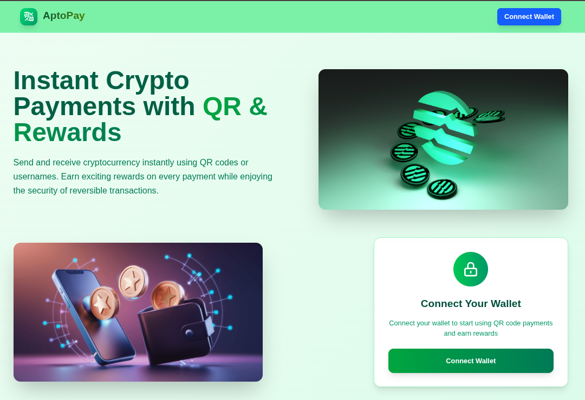

# AptoPay - Instant Crypto Payments with QR & Rewards

A modern, user-friendly cryptocurrency payment platform built on the Aptos blockchain that enables instant payments using QR codes and usernames with built-in reward systems.



- 🚀 **Deployment:** [aptopay.shubhh.xyz](https://aptopay.shubhh.xyz/)

## 🌟 Features

### Core Functionality
- **QR Code Payments**: Scan or share QR codes for instant, contactless payments
- **Username-Based Payments**: Send crypto using simple usernames instead of complex wallet addresses
- **Payment Rewards**: Earn exciting rewards and cashback on every transaction
- **Instant Payments**: Send and receive crypto in seconds with QR technology
- **Secure & Robust**: Military-grade security with reversible payment options
- **Request System**: Create and manage payment requests from other users

### User Experience
- **Beautiful UI**: Modern, responsive design with smooth animations
- **Wallet Integration**: Seamless Aptos wallet connection
- **Transaction History**: Complete payment tracking and history
- **Real-time Updates**: Live updates for incoming requests and payments
- **Multi-tab Interface**: Organized sections for Pay, Receive, Request, History, and Rewards

## 🚀 Quick Start

### Prerequisites
- Node.js 18+ 
- MongoDB database
- Aptos-compatible wallet (Petra recommended)

### Installation

1. **Clone the repository**
   ```bash
   git clone <repository-url>
   cd Aptopay
   ```

2. **Install dependencies**
   ```bash
   npm install
   ```

3. **Environment Configuration**
   Create a `.env.local` file:
   ```env
   MONGODB_URI=your_mongodb_connection_string
   MONGODB_DB=Aptopay
   APTOS_API_KEY_MAINNET=your_aptos_api_key
   PHOTON_API_KEY=your_photon_rewards_api_key
   PHOTON_JWT_SECRET=your_jwt_secret
   ```

4. **Run the development server**
   ```bash
   npm run dev
   ```

5. **Open your browser**
   Navigate to `http://localhost:3000`

## 🏗️ Project Structure

```
Aptopay/
├── app/                    # Next.js app directory
│   ├── api/               # API routes
│   │   ├── payments/      # Payment management
│   │   ├── requests/      # Payment requests
│   │   ├── rewards/       # Rewards system
│   │   └── users/         # User management
│   ├── hehe/              # Main dashboard
│   ├── pay/               # Send payments
│   ├── receive/           # Receive payments
│   └── register/          # User registration
├── components/            # React components
│   ├── paySection/        # Payment sending UI
│   ├── recieveSection/    # Payment receiving UI
│   ├── requestAPT/        # Payment requests
│   ├── paymentHistory/    # Transaction history
│   └── Rewards/           # Rewards display
├── Models/                # MongoDB models
│   ├── Payment.ts         # Payment records
│   ├── PaymentModel.ts    # Enhanced payment model
│   ├── Request.ts         # Payment requests
│   └── UserModel.ts       # User accounts
├── lib/                   # Utilities
│   ├── aptos.ts          # Aptos blockchain interaction
│   └── mongodb.ts        # Database connection
└── types/                 # TypeScript definitions
```

## 💻 Core Components

### Payment Flow
1. **User Registration**: Users register with wallet address and username
2. **Payment Creation**: Send payments via username or QR code scan
3. **On-chain Execution**: Transactions processed on Aptos blockchain
4. **Reward Distribution**: Automatic reward points for completed payments
5. **History Tracking**: All transactions stored in MongoDB

### Request System
- Create payment requests with custom amounts and memos
- Accept/reject incoming requests
- Automatic transaction execution on acceptance
- Real-time status updates

### Rewards Integration
- Integrated with Photon rewards platform
- Automatic user registration with Photon
- Event tracking for payment activities
- Custom reward calculation (100 points per 1 APT)

## 🔧 API Endpoints

### Payments
- `POST /api/payments` - Create new payment
- `GET /api/payments?address=...` - Get user payments
- `PUT /api/payments/update-status` - Update payment status

### Requests
- `POST /api/requests` - Create payment request
- `GET /api/requests?address=...&role=...` - Get user requests
- `POST /api/requests/[id]/accept` - Accept request
- `POST /api/requests/[id]/reject` - Reject request
- `POST /api/requests/[id]/cancel` - Cancel request

### Users
- `GET /api/users` - Get all users
- `POST /api/users/register` - Register new user

### Rewards
- `POST /api/rewards` - Record reward event
- `GET /api/rewards?walletAddress=...` - Get user rewards

## 🗄️ Database Models

### User Model
```typescript
{
  walletAddress: string;
  name: string;
  photonUserId?: string;
  photonAccessToken?: string;
  photonRefreshToken?: string;
  rewards: RewardHistory[];
  createdAt: Date;
}
```

### Payment Model
```typescript
{
  senderAddress: string;
  senderName: string;
  receiverAddress: string;
  receiverName: string;
  amount: string; // in wei
  amountInEth: string; // display amount
  expirationTimestamp: number;
  status: 'pending' | 'completed' | 'failed' | 'expired';
  transactionHash?: string;
}
```

### Request Model
```typescript
{
  requestId: string;
  requesterAddress: string;
  requesterName?: string;
  payerAddress?: string;
  amount: string;
  amountInHuman?: string;
  memo?: string;
  status: 'pending' | 'paid' | 'cancelled' | 'rejected';
  txHash?: string;
}
```

## 🔐 Security Features

- **Wallet Authentication**: Secure Aptos wallet integration
- **Input Validation**: Comprehensive form validation
- **SQL Injection Protection**: Mongoose with type safety
- **Transaction Security**: On-chain verification
- **Error Handling**: Comprehensive error boundaries

## 🎨 UI/UX Features

- **Responsive Design**: Works on all device sizes
- **Smooth Animations**: Framer Motion transitions
- **Real-time Updates**: Live payment status
- **Intuitive Navigation**: Tab-based interface
- **Visual Feedback**: Toast notifications and loading states

## 🚀 Deployment

### Vercel (Recommended)
1. Connect your GitHub repository to Vercel
2. Add environment variables in Vercel dashboard
3. Deploy automatically on git push

### Manual Deployment
```bash
npm run build
npm start
```

## 🤝 Contributing

1. Fork the repository
2. Create a feature branch (`git checkout -b feature/amazing-feature`)
3. Commit your changes (`git commit -m 'Add amazing feature'`)
4. Push to the branch (`git push origin feature/amazing-feature`)
5. Open a Pull Request

## 📝 License

This project is licensed under the MIT License - see the LICENSE file for details.

## 🆘 Support

For support and questions:
- Check the [Issues](../../issues) page
- Create a new issue with detailed description
- Contact the development team

## 🔮 Roadmap

- [ ] Multi-chain support
- [ ] Advanced reward tiers
- [ ] Payment scheduling
- [ ] Bulk payments
- [ ] Merchant integration
- [ ] Mobile app development

---

Built with ❤️ using Next.js, Aptos, and MongoDB